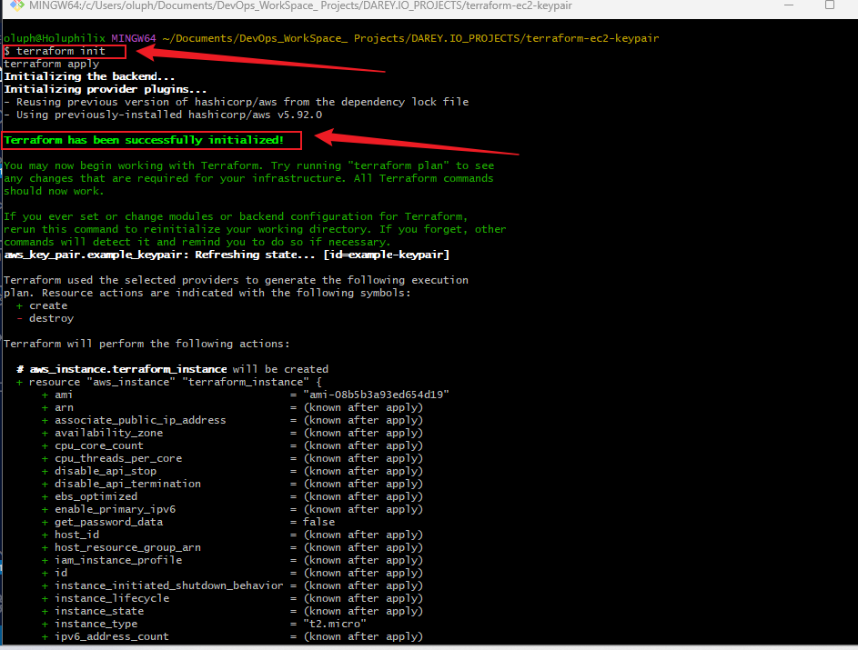
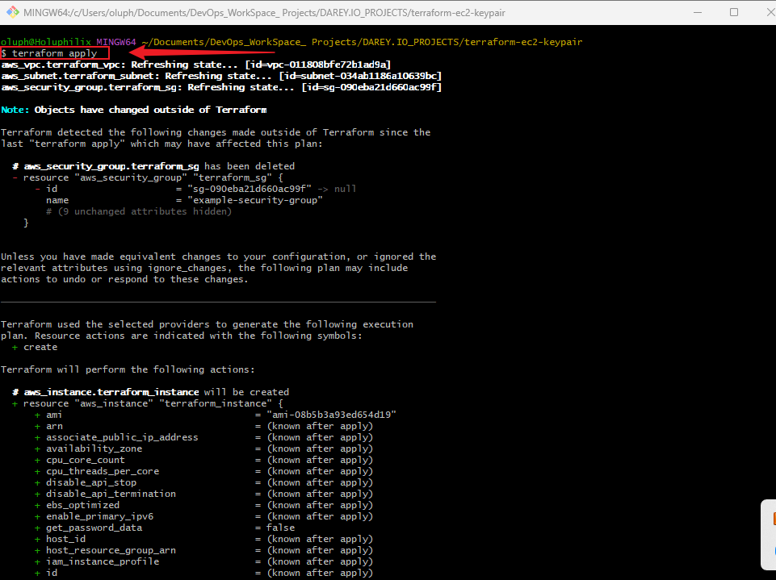
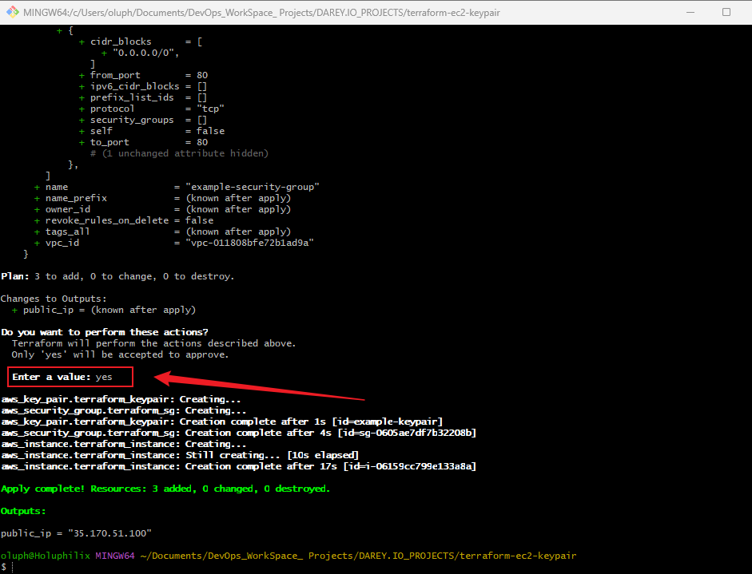
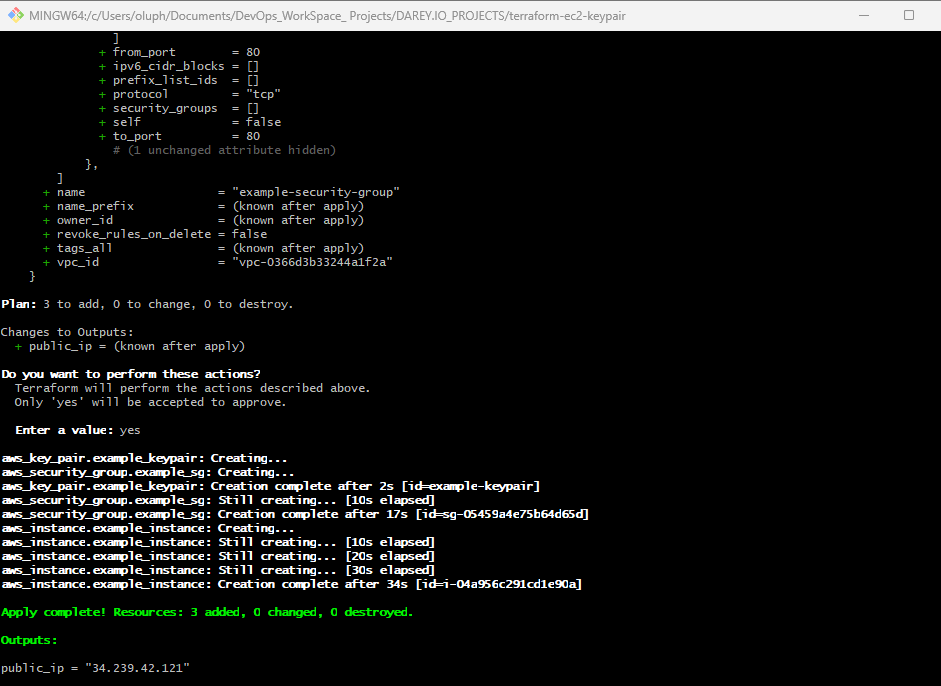
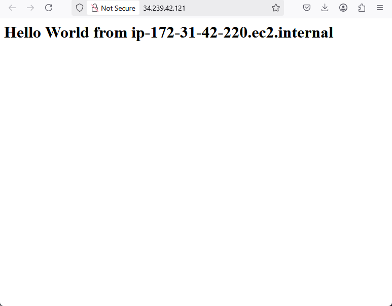
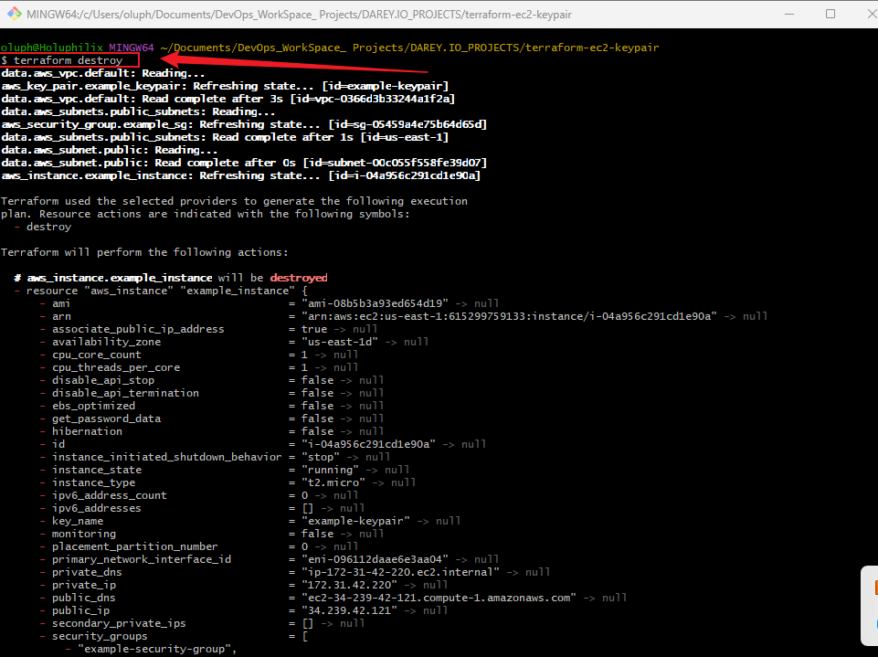
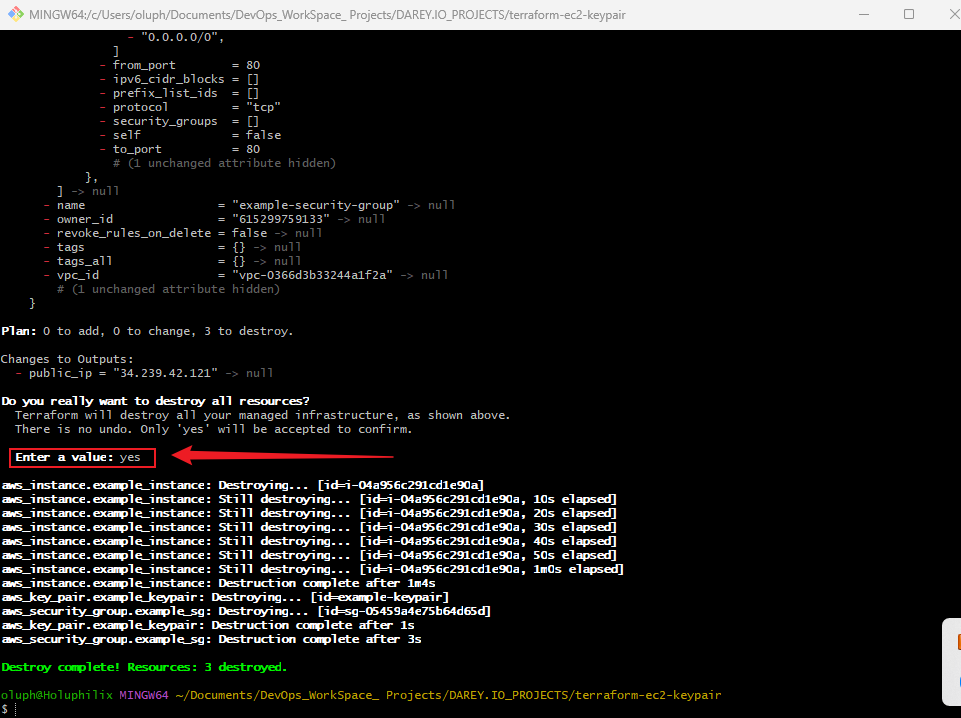

# Mini Project: Terraform EC2 Instance with Key Pair and User Data

## Project Overview

This project automates the process of launching an EC2 instance on AWS using Terraform. The EC2 instance is configured with a key pair for secure access, a security group allowing HTTP traffic, and a user data script that installs and configures Apache HTTP Server. This setup demonstrates how to use Terraform for infrastructure provisioning with EC2, key pairs, and user data.

## Prerequisites

Before you begin, ensure that you have the following:

- **Terraform** installed (version 1.x or later).
- **AWS CLI** installed and configured with your AWS credentials.
- A valid **SSH key pair** for access to the EC2 instance.

If Terraform and AWS CLI are not installed, follow the installation guides:
- [Install Terraform](https://learn.hashicorp.com/tutorials/terraform/install-cli)
- [Install AWS CLI](https://docs.aws.amazon.com/cli/latest/userguide/install-cliv2.html)

## Directory Structure

```
terraform-ec2-keypair/
├── main.tf
└── README.md
```

## Setup Instructions

Follow these steps to create and configure the EC2 instance using Terraform:

### 1. Create a new directory for the project:

```bash
mkdir terraform-ec2-keypair
cd terraform-ec2-keypair
```

### 2. Create a Terraform configuration file (`main.tf`):

Create a file named `main.tf` inside the project directory.

```bash
nano main.tf
```

### 3. Add Terraform configuration to `main.tf`:

```hcl
provider "aws" {
  region = "us-east-1"  # Change this to your desired AWS region
}

# Fetch default VPC ID
data "aws_vpc" "default" {
  default = true
}

# Fetch all subnets and pick the first one
data "aws_subnets" "public_subnets" {
  filter {
    name   = "vpc-id"
    values = [data.aws_vpc.default.id]
  }
}

data "aws_subnet" "public" {
  id = tolist(data.aws_subnets.public_subnets.ids)[0]
}

# Create Security Group in the default VPC
resource "aws_security_group" "example_sg" {
  name        = "example-security-group"
  description = "Allow HTTP and SSH traffic"
  vpc_id      = data.aws_vpc.default.id  # Attach to default VPC

  ingress {
    from_port   = 22
    to_port     = 22
    protocol    = "tcp"
    cidr_blocks = ["0.0.0.0/0"]  # Allows SSH access from any IP (Not recommended for production)
  }

  ingress {
    from_port   = 80
    to_port     = 80
    protocol    = "tcp"
    cidr_blocks = ["0.0.0.0/0"]  # Allows HTTP traffic from any IP
  }

  egress {
    from_port   = 0
    to_port     = 0
    protocol    = "-1"
    cidr_blocks = ["0.0.0.0/0"]
  }
}

resource "aws_key_pair" "example_keypair" {
  key_name   = "example-keypair"
  public_key = file("~/.ssh/id_rsa.pub")  # Replace with the path to your public key file
}

resource "aws_instance" "example_instance" {
  ami           = "ami-08b5b3a93ed654d19"  # Specify your desired AMI ID
  instance_type = "t2.micro"
  key_name      = aws_key_pair.example_keypair.key_name

  vpc_security_group_ids      = [aws_security_group.example_sg.id]  # Reference the created security group
  subnet_id                   = data.aws_subnet.public.id  # Ensure instance is in a public subnet
  associate_public_ip_address = true  # Assign a public IP

  user_data = <<-EOF
              #!/bin/bash
              yum update -y
              yum install -y httpd
              systemctl start httpd
              systemctl enable httpd
              echo "<h1>Hello World from $(hostname -f)</h1>" > /var/www/html/index.html
              EOF
}

output "public_ip" {
  value = aws_instance.example_instance.public_ip
}
```

### 4. Initialize the Terraform project:

Initialize your Terraform project to download the required providers.

```bash
terraform init
```
**Screenshot:** Terraform Init



### 5. Apply the Terraform configuration:

Apply the configuration to create the EC2 instance and other resources.

```bash
terraform apply
```
**Screenshot:** Terraform Apply


You will be prompted to confirm the action. Type `yes` to proceed.



### 6. Access the EC2 Instance:

Once the instance is created, Terraform will output the **public IP** of the instance. Use this IP address to access the Apache web server.

```bash
Output:
public_ip = "34.239.42.121" 
```
**Screenshot:** Output Public IP


In your web browser, enter the following URL to access the Apache server:

```
http://34.239.42.121
```
You should see a webpage displaying:

```
Hello World from <hostname>
```

**Screenshot:** Access the Apache server


### 7. Clean Up Resources:

To destroy the resources created by Terraform, run:

```bash
terraform destroy
```

**Screenshot:** Terraform destroy


Confirm by typing `yes` when prompted.

**Screenshot:** typing `yes` to destroy


## Troubleshooting

- **SSH Access Issues**: Ensure that your SSH private key is correctly paired with the EC2 instance.
- **Security Group**: Double-check your security group to ensure HTTP traffic (port 80) is allowed.
- **User Data Issues**: Check the EC2 instance logs for errors during user data execution by accessing the instance's `cloud-init` logs.

## Observations & Challenges

- **Public IP Change**: The public IP of the EC2 instance may change if the instance is stopped and started again. Consider using an Elastic IP for a static IP address.
- **Key Pair Management**: Be sure to securely store the private key used to connect to the EC2 instance. If you lose it, you won’t be able to access the instance.

## Conclusion

This project provided hands-on experience with Terraform for provisioning AWS EC2 instances. You learned how to configure EC2 instances with key pairs, security groups, and user data, as well as how to automate the process of deploying infrastructure in AWS.

## Now, let’s push it to your GitHub repository. Follow these steps:  

### **1️⃣ Initialize a Git Repository**
Navigate to your project directory in the terminal and run:  

```sh
git init
```
### **2️⃣ Create a `.gitignore` File**  
Before pushing, create a `.gitignore` file to exclude unnecessary files. Run:  
```sh
touch .gitignore
```
Then, open `.gitignore` and add the following:  
```
# Ignore Terraform state files and logs
*.tfstate
*.tfstate.backup
.terraform/
terraform.tfvars
terraform.tfvars.json
crash.log
```
Save the file.

### **3️⃣ Add and Commit Files**  
Run the following to add your files and commit them:  
```sh
git add .
git commit -m "Initial commit: Terraform EC2 Instance project"
```

### **4️⃣ Create a New GitHub Repository**
1. Go to [GitHub](https://github.com) and log in.
2. Click on **"New Repository"**.
3. Name it (e.g., `terraform-ec2-keypair`).
4. **Do not** initialize with a README (since we already have files).
5. Click **"Create repository"**.

**Screenshot:** Create New Repository


### **5️⃣ Link Your Local Repo to GitHub**
Copy the repository URL from GitHub and run:  

```sh
git remote add origin https://github.com/Holuphilix/terraform-ec2-keypair.git
```

### **6️⃣ Push to GitHub**
Run the following command to push your project:  

```sh
git branch -M main
git push -u origin main
```

### **7️⃣ Confirm on GitHub**
Go to your GitHub repository and check if the files are there.
